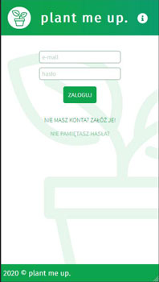
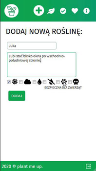
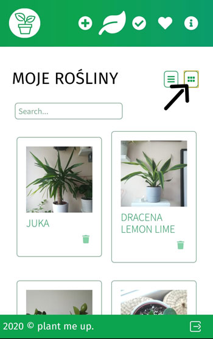
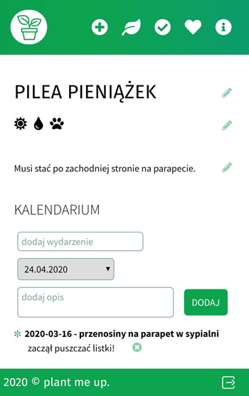
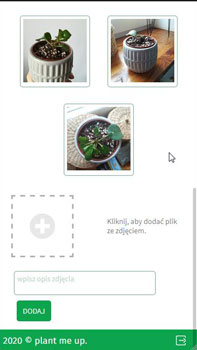
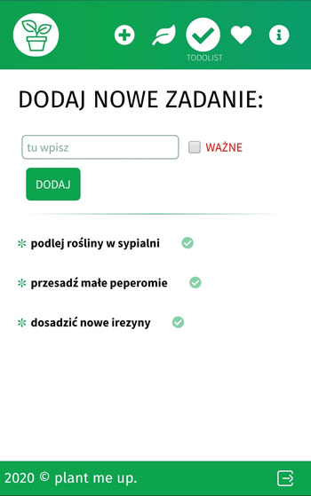
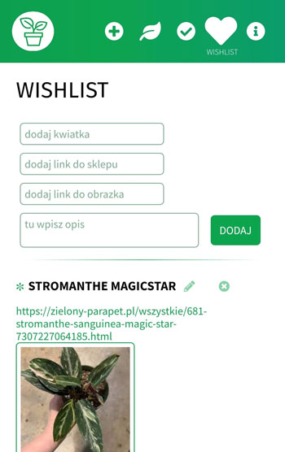

# PLANT ME UP 
**v. 1.0.0 (c) 2020**

developed in association with FAIRit project.

## Application for plants owners. 
- fully mobile and/or web
- fully personal
- fully intuitive and user friendly

This application helps to take care of your plants. You can put in one place all useful notes, plan your caring routine, make a calendar of events for every plant and collect photo documentation.

### Visit `https://plant-me-up.web.app/` and grow your personal jungle.

  

   

 

___
#### I create this project with React and Firebase. If you want to test it locally:

1. clone this repository
2. run `npm ic` to install all dependencies
   - `react-router-dom ^5.x`
   - `firebase ^7.x`
   - `node-sass ^4.x`
   - `fortawesome ^5.x`
3. run `npm start`
4. open address `localhost:3000` in your browser
5. have fun

*Contact me: turrrbokitty@gmail.com*